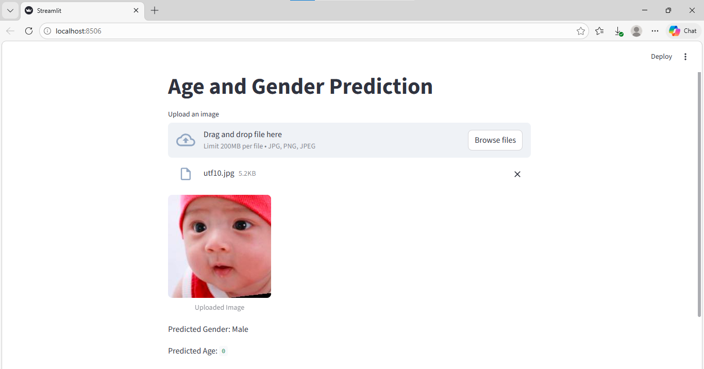
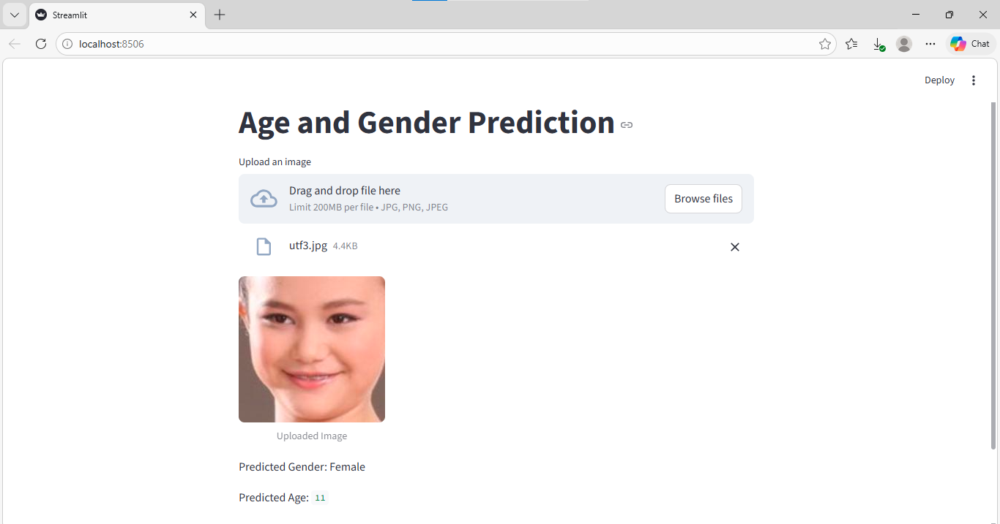
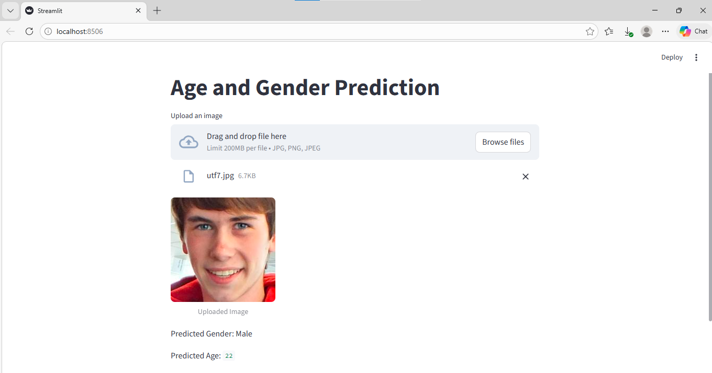
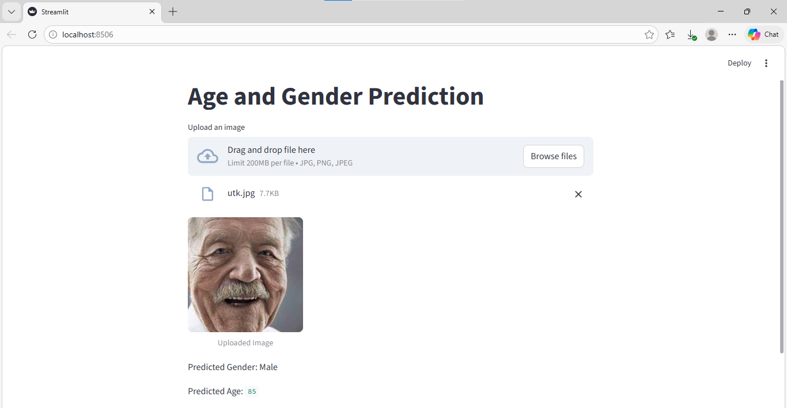

# 🎯 Age & Gender Prediction using Deep Learning

A deep learning-based Age and Gender Prediction system built using a Convolutional Neural Network (CNN) trained on the UTKFace dataset and deployed through a Streamlit web application for interactive image-based predictions.

---

## 🚀 Features

* 🖼️ Predicts age and gender from facial images
* 📊 Trained on real-world dataset (**UTKFace**)
* 🧠 Uses CNN for feature extraction
* 🌐 Simple web interface using Streamlit
* ⚡ Fast and efficient predictions

---

## 🧠 Model Details

* Architecture: **Convolutional Neural Network (CNN)**
* Framework: TensorFlow / Keras
* Dataset: **UTKFace Dataset**
* Input: Face images (normalized)

### Outputs:

* Gender → Binary Classification (Male/Female)
* Age → Regression (continuous value)

---

## 📁 Project Structure

```
Age-Gender-Prediction/
│
├── models/
│   └── age_gender_model.keras
│
├── outputs/
│   ├── output_1.png
│   ├── output_2.png
│   ├── output_3.png
│   ├── output_4.png
│
├── src/
│   └── app.py
│
├── README.md
├── requirements.txt
```

---

## 📦 Model File

The trained model (age_gender_model.keras) is stored using **Git LFS** due to its large size.

To download: Click on the file → Click "View Raw"

---

## Output Screenshots

### Output 1


### Output 2


### Output 3


### Output 4


---

## 📊 Dataset

The model is trained on the **UTKFace dataset**, which contains facial images labeled with:

* Age
* Gender
* Ethnicity

👉 This dataset helps the model learn diverse facial features across different age groups.

---

## ⚙️ Installation

1️⃣ Clone the repository

```bash
git clone https://github.com/Nayeem-Dev-129/Age_Gender_Prediction.git

cd Age_Gender_Prediction

pip install -r requirements.txt
```

2️⃣ Install dependencies

```bash
pip install -r requirements.txt
```

---

## ▶️ Run the Application

```bash
streamlit run src/app.py
```

---

## 📊 How It Works

1. Input image is uploaded through Streamlit
2. Face is detected using OpenCV Haar Cascade
3. Image is preprocessed (resize + normalization)
4. Passed into CNN model
5. Outputs:

   * Predicted Gender
   * Estimated Age

---

## 🛠️ Tech Stack

* Python 🐍
* TensorFlow / Keras 🤖
* OpenCV 👁️
* Streamlit 🌐

---

## 💡 Future Improvements

* Improve age prediction accuracy
* Use advanced architectures (MobileNetV2, ResNet)
* Deploy model on cloud
* Add real-time webcam support